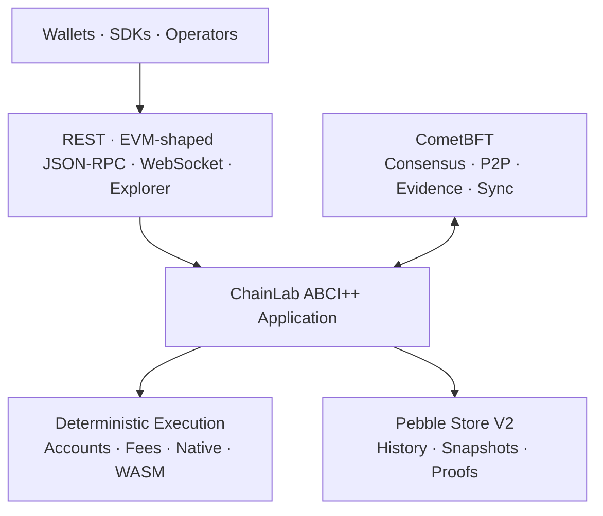

<p align="right">
  <strong>English</strong> · <a href="./README.zh-CN.md">简体中文</a>
</p>

<div align="center">
  <h1>ChainLab</h1>
  <p><strong>A verifiable sovereign blockchain stack, built in Go.</strong></p>
  <p>
    Deterministic execution · CometBFT ABCI++ · Pebble state · Native and WASM contracts · Authenticated proofs
  </p>
  <p>
    <a href="https://go.dev/doc/devel/release#go1.25.0"></a>
    <a href="https://github.com/cometbft/cometbft/releases/tag/v0.39.3"></a>
    
    
  </p>
</div>

> [!WARNING]
> ChainLab is in active development and private-network validation. It has not been externally audited or approved for public mainnet deployment, production validator custody, or real assets.

## Overview

ChainLab is a production-oriented sovereign blockchain protocol and ABCI++ application. It owns its deterministic state transition, accounts, fees, contracts, validator lifecycle, proofs, and upgrade semantics while integrating CometBFT for Byzantine consensus and Pebble for transactional state history.

The repository contains two deliberately separate execution environments:

- a fast local PoA harness for application replay, CLI workflows, fork/finality-lock experiments, and developer tooling;
- a real four-validator CometBFT network for authoritative ABCI++ lifecycle, P2P, proposal rounds, evidence, block sync, state sync, validator transitions, and fault recovery.

The local harness is not presented as production consensus. The CometBFT path is the production direction, but the remaining release, operations, economics, and security gates are explicit and still open.

## Architecture



| Layer | Implemented surface |
|---|---|
| Consensus | CometBFT v0.39.3 ABCI++, four-validator private networks, proposal replay, evidence, block/state sync, epoch updates |
| Execution | Canonical transactions, EIP-1559-style fees, included-failure settlement, native contracts, metered Wasmtime WASM |
| Accounts | EOAs, paymasters, atomic batches, `account.v1`, `multisig.v1`, delegated EOAs, session keys, guardian recovery |
| State | Atomic Pebble commits, incremental deltas/checkpoints, archive/full/pruned profiles, backup and verified snapshots |
| Verifiability | Transaction, receipt, and state roots; exact-total and sparse membership/non-membership proofs; standalone verifier |
| Interfaces | CLI, REST, EVM-shaped JSON-RPC subsets, filters, WebSocket subscriptions, bounded local explorer |

## What Works Today

### Protocol and execution

- secp256k1 signatures, Ethereum-style 20-byte addresses, balances, nonces, stake, account storage, and deterministic roots;
- transfers, EIP-1559-style fee caps, base-fee burn, proposer priority fees, paymaster sponsorship, and up to 128 atomic batch operations;
- deterministic included failures: business writes roll back while nonce and actual gas settlement remain committed; out-of-gas consumes the full gas limit;
- sealed `chainlab-native-v1` metering and version-pinned Wasmtime execution with deterministic fuel, bounded memory/tables, bounded host I/O, and atomic rollback;
- ChainLab-native smart accounts, threshold multisig, delegated EOA experiments, transfer/call session policies, and delayed social recovery.

### Consensus and validator lifecycle

- strict `Info`, `Query`, `CheckTx`, proposal, finalize, commit, vote-extension, snapshot, and state-sync boundaries;
- real 3-of-4 progress, deterministic 2-of-4 halt, symmetric 2+2 partition/heal, missing/delayed/invalid proposer recovery, restart, replay, block sync, and destructive-data state sync;
- Comet-verified duplicate-vote, same-height light-client equivocation, and cross-height forward-lunatic evidence followed by epoch removal;
- genesis-certified and runtime-certified stake-derived validator admission with quorum authorization, committed-root binding, gas-metered certificates, `H+2` updates, and real multi-process transition evidence;
- optional evidence-removal unbonding and V5 offence retention. Re-entry, runtime power changes, voluntary leave, rewards, and key operations remain incomplete.

### Storage, upgrades, and proofs

- one synchronized Pebble batch per height for state, results, commitments, indexes, history metadata, and current pointer;
- flat live state plus mutation-derived deltas and checkpoints, deterministic migration, compaction, consistent backups, integrity validation, and verified snapshot restore;
- genesis-committed `chainlab-v2 → chainlab-v3 → chainlab-v4 → chainlab-v5` activation;
- V3 exact-total transaction/receipt/state roots, V4 mutation-aware sparse state, and V5 safe compaction for timestamped validator offences;
- standalone trusted-root proof verification for current and retained mixed-version history.

## Quick Start

### Prerequisite

Go **1.25.12** is the minimum supported toolchain. The patch version is security-sensitive because older Go 1.25 standard libraries contain vulnerabilities reachable from HTTP, TLS, URL, and template paths used by this project.

```powershell
git clone https://github.com/HONG-LOU/blockchain-chain-lab.git
cd blockchain-chain-lab

go test ./...
go run ./cmd/chainlab demo
```

The demo exercises transfers, sponsorship, batching, smart accounts, multisig, native contracts, WASM upload/deploy/call, token state, and staking without requiring external services.

## Run a Local Explorer

Create public genesis data and a separate non-overwriting development key file:

```powershell
go run ./cmd/chainlab init `
  --out config/genesis.json `
  --key-out config/validator-1-key.json

go run ./cmd/chainlab node `
  --genesis config/genesis.json `
  --key-file config/validator-1-key.json `
  --listen :8547 `
  --data-dir data/localnet
```

Open [http://127.0.0.1:8547/explorer](http://127.0.0.1:8547/explorer).

Generated keys are for isolated development only. Key files are excluded from Git, created with exclusive-create semantics, and must never be used for production custody.

Useful commands:

```powershell
go run ./cmd/chainlab query head
go run ./cmd/chainlab query fees
go run ./cmd/chainlab query mempool
go run ./cmd/chainlab chain produce
```

## Run a Four-Validator Network

Generate four independent CometBFT homes:

```powershell
go run ./cmd/chainlab-comet init `
  --out data/comet-private `
  --chain-id chainlab-private
```

Start the application and Comet process for `node0`:

```powershell
go run ./cmd/chainlab-abci `
  --genesis data/comet-private/node0/config/chainlab-genesis.json `
  --data-dir data/comet-private/node0/data/chainlab-app `
  --listen tcp://127.0.0.1:26658

go run ./cmd/chainlab-comet node --home data/comet-private/node0
```

Repeat for `node1` through `node3` using the addresses in `network.json`. The generated network uses independent validator and P2P identities, a full-mesh peer topology, bounded continuous blocks, and one single-writer Pebble application database per node.

For automated process evidence:

```powershell
go test ./internal/cometnode -count=1
```

See [CometBFT Fault Network Evidence](docs/chainlab-comet-fault-network.md) for the exact tested boundary.

## Storage Profiles

| Profile | Retention contract |
|---|---|
| `archive` | Retain every locally available height |
| `full` | Retain a configured recent window from a checkpoint boundary |
| `pruned` | Retain only the latest committed height |

```powershell
go run ./cmd/chainlab-abci --genesis genesis.json --data-dir app-data --storage-mode archive
go run ./cmd/chainlab-abci --genesis genesis.json --data-dir app-data --storage-mode full --retain-heights 50000 --checkpoint-interval 500
go run ./cmd/chainlab-abci --genesis genesis.json --data-dir app-data --storage-mode pruned
```

Read the precise guarantees in [Application Store V2](docs/chainlab-application-storage-v2.md).

## Verification

The repository currently passes the following local validation on Go 1.25.12 / Windows amd64:

```powershell
go test -count=1 ./...
go test -race -short -count=1 ./...
go vet ./...
go build ./cmd/...
go run ./cmd/chainlab demo
go mod tidy -diff
```

The full suite includes deterministic execution, restart/corruption boundaries, proofs/upgrades, resource limits, and real multi-process CometBFT networks. This is strong development evidence, not a substitute for Linux release qualification, sustained load, external review, or a public adversarial testnet.

## Production Boundary

| Available and tested now | Required before public mainnet |
|---|---|
| Deterministic application replay and bounded execution | Pinned Linux/amd64 replay, fuzz/property/load/soak programs, hard JIT/RSS evidence |
| CometBFT ABCI++ private networks and tested fault recovery | Dynamic packet faults, asymmetric partitions, broader Byzantine cases, Comet binary rolling drills |
| Runtime-certified admission and evidence-driven removal | Re-entry, runtime power changes, voluntary leave, reward/slashing economics, key rotation |
| Pebble atomic history, snapshots, backup, and proofs | Operational restore drills, external rollback protection, production capacity evidence |
| Genesis-scheduled V2–V5 upgrades | Runtime-authorized upgrades, signed compatibility manifests, rollback policy |
| Bounded RPC, filters, WebSocket, CLI, and explorer | Principal-aware limits, production indexer/wallet/SDK, metrics, alerts, audit logs |
| Development key separation and process locking | Remote signer/HSM, monotonic last-sign recovery, operator security runbooks |
| Internal automated security and fault tests | Reproducible release/SBOM/provenance and independent security/consensus review |

Governance transaction names are reserved but fail closed before admission. ChainLab does not claim general EVM execution compatibility, canonical ERC-4337/EIP-7702 compatibility, production token economics, official stablecoin availability, or mainnet readiness.

## Documentation

| Document | Purpose |
|---|---|
| [Production Gates](docs/mainstream-chain-capability-and-production-gates-2026-07-10.md) | Authoritative completion criteria and upstream references |
| [Technology Roadmap](docs/current-blockchain-tech-roadmap.md) | Ordered implementation path |
| [Progress and Next Steps](docs/chainlab-progress-and-next-steps-2026-07-10.md) | Verified milestones and current blockers |
| [Validator Lifecycle](docs/chainlab-v2-validator-lifecycle.md) | V2 identity, evidence, admission, epoch, and unbonding rules |
| [CometBFT Fault Network](docs/chainlab-comet-fault-network.md) | Exact real-process availability and fault evidence |
| [Application Store V2](docs/chainlab-application-storage-v2.md) | Atomic layout, retention, migration, backup, and recovery |
| [V3 Proofs and Upgrades](docs/chainlab-v3-proofs-and-upgrades.md) | Scheduled activation and exact-total proofs |
| [V4 Sparse State](docs/chainlab-v4-sparse-state.md) | Mutation-aware sparse membership/non-membership |
| [V5 Offence Retention](docs/chainlab-v5-offence-retention.md) | Timestamped offence compaction rules |

## Repository Map

```text
cmd/                 CLI, ABCI server, proof verifier, Comet network tools
internal/abci/       ABCI++ application and protocol lifecycle
internal/cometnode/  Network generation and real-process evidence
internal/core/       Deterministic transaction execution and fee settlement
internal/contracts/  Native and Wasmtime contract runtimes
internal/state/      Canonical state and validator lifecycle
internal/node/       Local PoA development harness and persistence
internal/rpc/        REST, JSON-RPC, WebSocket, filters, and explorer
internal/types/      Canonical protocol schemas and raw envelopes
pkg/proof/           Independent proof verification
docs/                Protocol contracts, evidence, and production gates
```

---

<div align="center">
  <strong>Build what can be replayed. Claim only what has been verified.</strong>
</div>
