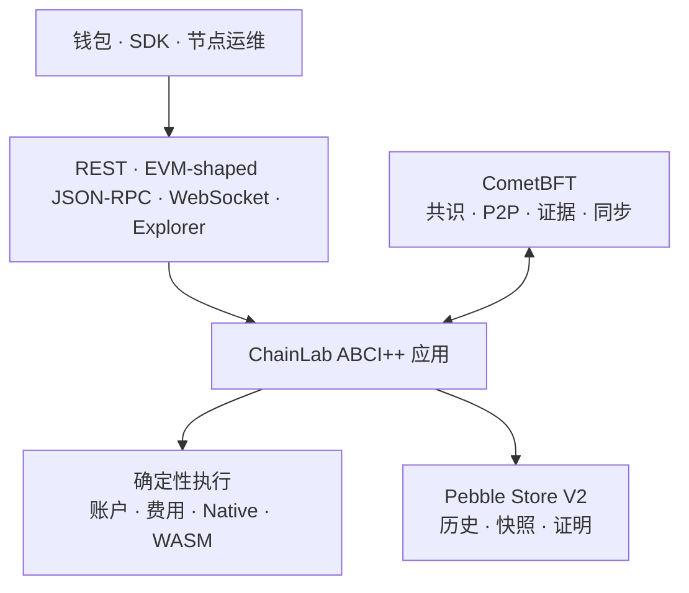

<p align="right">
  <a href="./README.md">English</a> · <strong>简体中文</strong>
</p>

<div align="center">
  <h1>ChainLab</h1>
  <p><strong>一个用 Go 构建、以可验证性为核心的主权区块链技术栈。</strong></p>
  <p>
    确定性执行 · CometBFT ABCI++ · Pebble 状态 · Native/WASM 合约 · 可认证证明
  </p>
  <p>
    <a href="https://go.dev/doc/devel/release#go1.25.0"></a>
    <a href="https://github.com/cometbft/cometbft/releases/tag/v0.39.3"></a>
    
    
  </p>
</div>

> [!WARNING]
> ChainLab 当前处于持续开发和私有网络验证阶段，尚未经过外部安全审计，也未获准用于公共主网、生产验证者密钥托管或真实资产。

## 项目概览

ChainLab 是一个面向生产目标设计的主权区块链协议和 ABCI++ 应用。项目掌握自己的确定性状态转换、账户、费用、合约、验证者生命周期、证明和升级语义，同时集成 CometBFT 提供拜占庭共识，使用 Pebble 保存事务型状态历史。

仓库明确区分两套运行环境：

- 快速本地 PoA harness：用于应用重放、CLI 工作流、分叉/finality-lock 实验和开发工具；
- 真实四验证者 CometBFT 网络：用于权威 ABCI++ 生命周期、P2P、提案轮次、证据、区块同步、状态同步、验证者转换和故障恢复。

本地 harness 不会被描述为生产共识。CometBFT 路径是生产方向，但发布、运维、经济和安全门槛仍被明确列出，尚未关闭。

## 架构



| 层级 | 已实现能力 |
|---|---|
| 共识 | CometBFT v0.39.3 ABCI++、四验证者私网、提案重放、证据、区块/状态同步、epoch 更新 |
| 执行 | 规范交易、EIP-1559 风格费用、失败交易结算、Native 合约、计量式 Wasmtime WASM |
| 账户 | EOA、Paymaster、原子批处理、`account.v1`、`multisig.v1`、委托 EOA、Session Key、Guardian Recovery |
| 状态 | Pebble 原子提交、增量 delta/checkpoint、archive/full/pruned、备份和验证式快照 |
| 可验证性 | 交易/receipt/state root、精确总量证明、稀疏成员/非成员证明、独立 verifier |
| 接口 | CLI、REST、EVM-shaped JSON-RPC 子集、Filter、WebSocket、本地有界 Explorer |

## 当前可用能力

### 协议与执行

- secp256k1 签名、Ethereum 风格 20 字节地址、余额、nonce、stake、账户存储和确定性 root；
- 转账、EIP-1559 风格 fee cap、base fee burn、proposer priority fee、Paymaster 赞助和最多 128 个原子 batch operation；
- 确定性 included failure：业务写入回滚，但 nonce 和实际 gas 结算保留；out-of-gas 消耗完整 gas limit；
- 封闭的 `chainlab-native-v1` 计量和版本固定的 Wasmtime 执行，包括确定性 fuel、固定资源、受限 host I/O 和原子回滚；
- ChainLab-native 智能账户、阈值多签、委托 EOA 实验、transfer/call session policy 和延迟式社交恢复。

### 共识与验证者生命周期

- 严格的 `Info`、`Query`、`CheckTx`、proposal、finalize、commit、vote extension、snapshot 和 state sync 边界；
- 真实 3/4 继续出块、2/4 确定停滞、2+2 分区恢复、proposer 缺失/延迟/无效提案恢复、重启、重放、区块同步和破坏数据后的状态同步；
- Comet 验证的 duplicate vote、同高度 light-client equivocation 和跨高度 forward-lunatic 证据，以及随后的 epoch removal；
- genesis/runtime certified stake-derived validator admission，包括 quorum 授权、committed root 绑定、证书 gas 计量、`H+2` update 和真实多进程转换证据；
- 可选 evidence-removal unbonding 和 V5 offence retention。re-entry、运行期 power change、主动退出、奖励和 key operation 尚未完成。

### 存储、升级与证明

- 每个高度使用一个同步 Pebble batch，原子提交状态、结果、commitment、索引、历史元数据和 current pointer；
- flat live state、mutation-derived delta/checkpoint、确定性迁移、compaction、一致性备份、完整性校验和验证式快照恢复；
- genesis 承诺的 `chainlab-v2 → chainlab-v3 → chainlab-v4 → chainlab-v5` 激活路径；
- V3 精确总量 transaction/receipt/state root、V4 mutation-aware sparse state、V5 timestamped offence 安全压缩；
- 对当前及保留混合版本历史进行 trusted-root 独立 proof 验证。

## 快速开始

### 环境要求

最低支持 Go **1.25.12**。这个 patch 版本属于安全边界：更早的 Go 1.25 标准库包含项目 HTTP、TLS、URL 和模板路径可达的漏洞。

```powershell
git clone https://github.com/HONG-LOU/blockchain-chain-lab.git
cd blockchain-chain-lab

go test ./...
go run ./cmd/chainlab demo
```

内置 demo 无需外部服务，会覆盖转账、赞助、批处理、智能账户、多签、Native 合约、WASM 上传/部署/调用、Token 状态和质押。

## 启动本地 Explorer

创建公开 genesis 数据和独立、不可覆盖的开发密钥文件：

```powershell
go run ./cmd/chainlab init `
  --out config/genesis.json `
  --key-out config/validator-1-key.json

go run ./cmd/chainlab node `
  --genesis config/genesis.json `
  --key-file config/validator-1-key.json `
  --listen :8547 `
  --data-dir data/localnet
```

打开 [http://127.0.0.1:8547/explorer](http://127.0.0.1:8547/explorer)。

生成密钥仅用于隔离开发。密钥文件被 Git 忽略并以 exclusive-create 方式创建，绝不能用于生产托管。

常用命令：

```powershell
go run ./cmd/chainlab query head
go run ./cmd/chainlab query fees
go run ./cmd/chainlab query mempool
go run ./cmd/chainlab chain produce
```

## 启动四验证者网络

生成四套独立 CometBFT home：

```powershell
go run ./cmd/chainlab-comet init `
  --out data/comet-private `
  --chain-id chainlab-private
```

启动 `node0` 的 application 与 Comet 进程：

```powershell
go run ./cmd/chainlab-abci `
  --genesis data/comet-private/node0/config/chainlab-genesis.json `
  --data-dir data/comet-private/node0/data/chainlab-app `
  --listen tcp://127.0.0.1:26658

go run ./cmd/chainlab-comet node --home data/comet-private/node0
```

按照 `network.json` 中的地址为 `node1` 到 `node3` 重复启动。生成网络包含独立 validator/P2P identity、full-mesh peer topology、有界连续出块，以及每节点一个 single-writer Pebble 应用数据库。

自动化真实进程证据：

```powershell
go test ./internal/cometnode -count=1
```

精确测试边界见 [CometBFT 故障网络证据](docs/chainlab-comet-fault-network.md)。

## 存储模式

| 模式 | 保留契约 |
|---|---|
| `archive` | 保留所有本地可用高度 |
| `full` | 从 checkpoint 边界保留配置的近期窗口 |
| `pruned` | 只保留最新 committed height |

```powershell
go run ./cmd/chainlab-abci --genesis genesis.json --data-dir app-data --storage-mode archive
go run ./cmd/chainlab-abci --genesis genesis.json --data-dir app-data --storage-mode full --retain-heights 50000 --checkpoint-interval 500
go run ./cmd/chainlab-abci --genesis genesis.json --data-dir app-data --storage-mode pruned
```

精确定义见 [Application Store V2](docs/chainlab-application-storage-v2.md)。

## 验证

仓库当前在 Go 1.25.12 / Windows amd64 上通过：

```powershell
go test -count=1 ./...
go test -race -short -count=1 ./...
go vet ./...
go build ./cmd/...
go run ./cmd/chainlab demo
go mod tidy -diff
```

完整测试包含确定性执行、重启/损坏边界、proof/upgrade、资源上限和真实多进程 CometBFT 网络。这是强开发证据，但不能替代 Linux 发布资格、持续负载、外部审计或公共对抗测试网。

## 生产边界

| 当前已实现并验证 | 公共主网上线前仍需完成 |
|---|---|
| 确定性应用重放与有界执行 | 固定 Linux/amd64 replay、fuzz/property/load/soak、JIT/RSS 硬证据 |
| CometBFT ABCI++ 私网和故障恢复 | 动态 packet fault、非对称分区、更广 Byzantine 行为、Comet binary rolling drill |
| runtime certified admission 和 evidence removal | re-entry、运行期 power change、主动退出、reward/slashing economics、key rotation |
| Pebble 原子历史、快照、备份和证明 | 运维恢复演练、外部 rollback protection、生产容量证据 |
| genesis-scheduled V2–V5 upgrade | runtime-authorized upgrade、签名兼容 manifest、rollback policy |
| 有界 RPC、Filter、WebSocket、CLI、Explorer | principal-aware 限流、生产 indexer/wallet/SDK、metrics、alert、audit log |
| 开发密钥分离与进程锁 | Remote signer/HSM、monotonic last-sign recovery、operator security runbook |
| 内部自动安全/故障测试 | 可复现 release、SBOM/provenance、独立安全与共识审计 |

治理交易名称已预留，但会在 admission 前 fail closed。ChainLab 不声称通用 EVM 执行兼容、正式 ERC-4337/EIP-7702 兼容、生产 Token 经济、官方稳定币可用或主网就绪。

## 文档

| 文档 | 用途 |
|---|---|
| [生产完成门槛](docs/mainstream-chain-capability-and-production-gates-2026-07-10.md) | 权威完成标准与上游参考 |
| [技术路线图](docs/current-blockchain-tech-roadmap.md) | 有序实施路径 |
| [进度与下一步](docs/chainlab-progress-and-next-steps-2026-07-10.md) | 已验证里程碑和当前阻塞 |
| [验证者生命周期](docs/chainlab-v2-validator-lifecycle.md) | V2 identity、evidence、admission、epoch 和 unbonding 规则 |
| [CometBFT 故障网络](docs/chainlab-comet-fault-network.md) | 真实进程 availability/fault 证据 |
| [Application Store V2](docs/chainlab-application-storage-v2.md) | 原子布局、retention、migration、backup 和 recovery |
| [V3 Proof 与 Upgrade](docs/chainlab-v3-proofs-and-upgrades.md) | 定时激活和精确总量证明 |
| [V4 Sparse State](docs/chainlab-v4-sparse-state.md) | mutation-aware sparse 成员/非成员证明 |
| [V5 Offence Retention](docs/chainlab-v5-offence-retention.md) | timestamped offence 压缩规则 |

## 仓库结构

```text
cmd/                 CLI、ABCI server、proof verifier、Comet network tool
internal/abci/       ABCI++ application 与 protocol lifecycle
internal/cometnode/  network generation 与真实进程证据
internal/core/       确定性 transaction execution 与 fee settlement
internal/contracts/  Native 和 Wasmtime contract runtime
internal/state/      canonical state 与 validator lifecycle
internal/node/       本地 PoA 开发 harness 与 persistence
internal/rpc/        REST、JSON-RPC、WebSocket、Filter 与 Explorer
internal/types/      canonical protocol schema 与 raw envelope
pkg/proof/           独立 proof verification
docs/                协议契约、证据和生产门槛
```

---

<div align="center">
  <strong>只构建可以重放的系统，只声明已经验证的能力。</strong>
</div>
